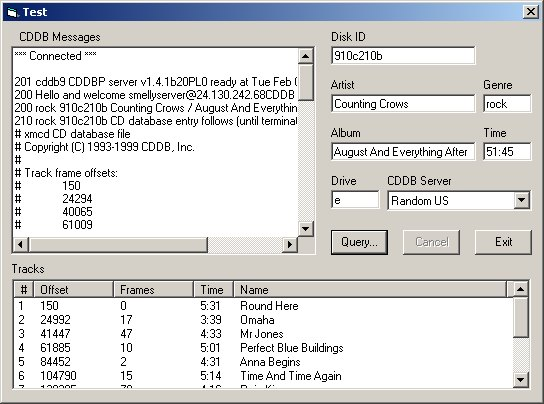



## ActiveX CDDB Control

### Description

This control has been reworked from the original by Michael L. Barker. It is now much more robust and has many more properties. It exposes all CD info (lengths/frames/offsets/number of tracks) and will connect to CDDB to grab album/genre/artist/track names. Enjoy!

Thanks to Michael and whoever supplied the CCd.cls class.
 
### More Info
 
To connect, you must supply a drive letter which has the CD to process, and specify which CDDB server (if any) to contact.

This code uses the Winsock control for testing and also needs a reference to the file system object (Scripting runtime - sccrun.dll) both of which should be handled automagically.

Properties expose basic CD info initially. While communicating CDDB, it will return messages via AllServerMessages event. After the connection is closed, it will expose album/artist/track names thru properties.

See the readme for details (not too many.)

             |
---                |---
**Submitted On**   |2001-02-06 12:04:58
**By**             |[Jodoveepn](https://github.com/Planet-Source-Code/PSCIndex/blob/master/ByAuthor/jodoveepn.md)
**Level**          |Intermediate
**User Rating**    |5.0 (35 globes from 7 users)
**Compatibility**  |VB 6\.0
**Category**       |[Sound/MP3](https://github.com/Planet-Source-Code/PSCIndex/blob/master/ByCategory/sound-mp3__1-45.md)
**World**          |[Visual Basic](https://github.com/Planet-Source-Code/PSCIndex/blob/master/ByWorld/visual-basic.md)
**Archive File**   |[CODE\_UPLOAD14580262001\.zip](https://github.com/Planet-Source-Code/jodoveepn-activex-cddb-control__1-15052/archive/master.zip)

### API Declarations

See the code - modMain.bas

